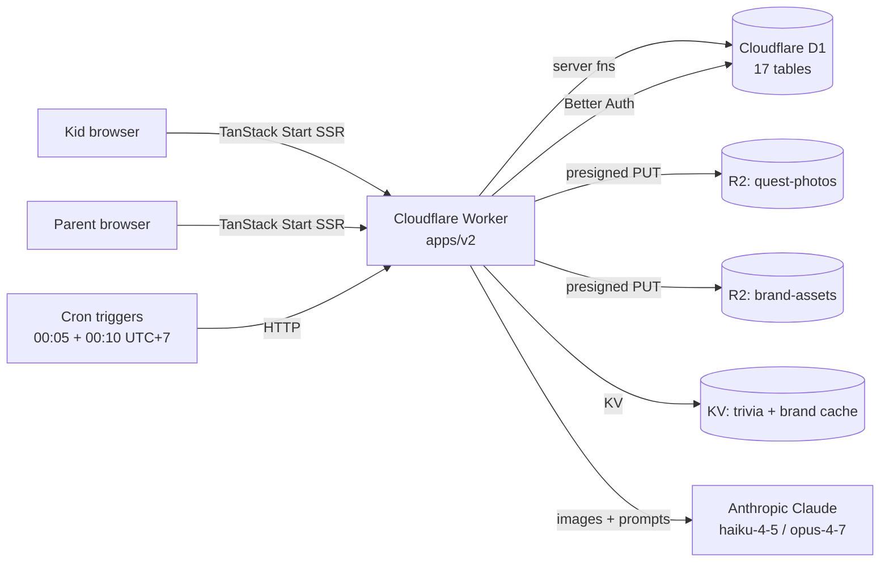

<div align="center">
  

# HeroQuest

**Real-world good deeds. Heroic rewards.**

A gamified app where children submit good deeds with photo proof, and elders (parents / teachers / admins) approve them in exchange for XP and Brave Coins. Every community can deploy their own branded copy — name, mascot, colors, currency, and reward catalog are all editable in-app.

</div>

---

## Try it locally in 60 seconds (offline demo)

No Cloudflare account, no Anthropic key, no real auth providers required. The demo flow boots a self-contained instance: Wrangler's built-in emulator handles D1 / R2 / KV against your filesystem, and AI calls fall back to canned responses.

```bash
pnpm install
pnpm demo            # copies .dev.vars.demo → .dev.vars, runs migrate + seed + vite dev
```

Then in another terminal, once registered at <http://localhost:5173/register>:

```bash
# Promote yourself to admin so you can see /approvals, /branding, /admin-*:
wrangler d1 execute heroquest --local \
  --command="UPDATE user_profile SET role='admin' WHERE user_id IN (SELECT id FROM user LIMIT 1);"
```

See [`apps/v2/.dev.vars.demo`](apps/v2/.dev.vars.demo) for the keys it sets, and [`packages/ai/src/demo-stubs.ts`](packages/ai/src/demo-stubs.ts) for what the AI returns in demo mode (deterministic, so screenshots are stable).

---

## Screenshots

> _The app boots offline via `pnpm demo` — screenshots below are captured against that flow so they reproduce on any machine._
>
> _Pages render but PNGs haven't been committed yet — drop them under `docs/screens/` and replace the placeholders. Pre-sized 1440×900 (desktop) and 390×844 (mobile) recommended._

| Screen | Path | Placeholder |
| --- | --- | --- |
| Landing | `/` |  |
| Dashboard | `/dashboard` (XP bar, streak flame, Sparky, recent quests) |  |
| Submit quest | `/submit` (camera + compression + form) |  |
| Approvals | `/approvals` (admin / parent decides XP+coins per row) |  |
| Games hub | `/games` (Spin / Memory / Trivia, one-per-day) |  |
| Rewards shop | `/rewards` (redeem with Brave Coins) |  |
| Family + sibling leaderboard | `/family` |  |
| Branding admin | `/branding` (rename app, swap mascot, recolor) |  |

---

## Architecture



**Brand & catalog layer** sits in `tenant_settings` (D1) + `BRAND_ASSETS` (R2) + a 60-second KV cache. Brand reads go through `resolveTenantId(request)` — today always `'default'`, future-flippable to hostname-based multi-tenant in one place.

---

## Monorepo layout

```
apps/
  legacy/             Frozen Next.js 16 + Firebase app (archived, kept for reference).
  v2/                 TanStack Start + Cloudflare rebuild — the live app.
packages/
  db/                 Drizzle schema, Zod types, D1 helpers, and the pure rule
                      modules (levels, achievements, applyDecision, streaks,
                      mini-game scoring, chore schedule, invite codes, brand merge).
  ai/                 Anthropic SDK wrapper with prompt-cached system prompts +
                      offline demo stubs.
  ui/                 Shared cn() + rarity helpers.
  config/             Tailwind preset, tsconfig presets.
```

---

## Stack (v2)

| Layer | Choice |
| --- | --- |
| Framework | TanStack Start (React 19, file-based routing, server functions) |
| Runtime | Cloudflare Workers via `@cloudflare/vite-plugin` |
| DB | Cloudflare D1 + Drizzle ORM |
| Storage | Cloudflare R2 (S3-compatible, presigned uploads, auth-gated read proxy) |
| Auth | Better Auth (email/password + Google OAuth) |
| AI | Anthropic Claude — `claude-haiku-4-5` for deed eval + trivia, `claude-opus-4-7` for insights; prompt caching on the system message |
| UI | Tailwind + custom components (XPBar, MascotSparky, CoinCounter, StreakFlame, QuestCard, LevelUpOverlay) + Framer Motion + Howler.js |
| PWA | vite-plugin-pwa (injectManifest) — custom service worker, IndexedDB-backed offline draft queue, install prompt |
| i18n | Custom EN/TH with parity check |

---

## Feature inventory

**Submitting + approval**
- Photo capture → client-side compression (`browser-image-compression`) → presigned R2 PUT → submitQuest server fn → admin/parent approves → atomic D1 batch (quest + profile + notification + achievement check)
- Auth-gated R2 read proxy so children's photos never go public
- Parents can only approve their family's quests; admins see everything

**Progression**
- 100 hero levels, curve `floor(100 × (level − 1)^1.55)`, configurable titles per-community
- 12 baked-in achievements with editable display copy (rules stay in code)
- Global + family-scoped leaderboards, opt-out per user
- Brave Coins → reward shop with shipment status tracking

**Engagement**
- Daily streaks with milestone bonuses (3 / 7 / 14 / 30 / 60 / 100 days)
- Daily mini-games (one-per-day enforced by D1 UNIQUE index): Spin-the-Wheel, Memory Match, AI-generated Trivia
- AI deed evaluator suggests XP+coins from photo+description (with Claude prompt caching → ~90% cost reduction on batches)

**Multi-community / branding** (Phase 8)
- `/branding` — app name, logo + mascot upload, 5-color palette, fonts, currency + XP terminology
- `/admin-rewards`, `/admin-achievements`, `/admin-levels` — CRUD over each catalog
- Brand-aware: topbar, landing, AI prompts, manifest, favicon, mascot all read from the active tenant's config (60s KV cache)
- Future-proof multi-tenant seam via `resolveTenantId()`

**Family & chores**
- Family group with 8-char readable invite codes
- Parent-defined recurring chores (daily / weekdays / weekly / custom CSV)
- Cron at 00:10 UTC+7 materializes today's instances per kid
- Chore completion auto-approves with template XP+coins, parent gets spot-review notification

**PWA**
- Installable, offline shell precached
- Quest drafts queue in IndexedDB when offline; background sync replays on reconnect

---

## Development

```bash
pnpm install
pnpm -F v2 dev               # vite dev (assumes .dev.vars exists)
pnpm -F v2 typecheck         # tsc --noEmit
pnpm -F v2 test              # vitest run — 101 tests across 10 files
pnpm -F v2 i18n:check        # EN/TH key parity guard
pnpm -F v2 db:gen            # drizzle-kit generate (schema → SQL migration)
pnpm -F v2 db:studio         # drizzle-kit studio (DB explorer)
```

### Production deploy (real Cloudflare)

```bash
# One-time:
wrangler d1 create heroquest                           # → paste IDs into wrangler.jsonc
wrangler r2 bucket create heroquest-quest-photos
wrangler r2 bucket create heroquest-avatars
wrangler r2 bucket create heroquest-brand-assets
wrangler kv:namespace create TRIVIA_KV
wrangler secret put BETTER_AUTH_SECRET                 # any 32+ char random
wrangler secret put ANTHROPIC_API_KEY                  # sk-ant-…
wrangler secret put R2_ACCOUNT_ID
wrangler secret put R2_ACCESS_KEY_ID
wrangler secret put R2_SECRET_ACCESS_KEY
# Optional:
wrangler secret put GOOGLE_CLIENT_ID
wrangler secret put GOOGLE_CLIENT_SECRET

# Each release:
pnpm db:migrate:prod
pnpm -F v2 deploy:preview                              # smoke-test on preview env
pnpm -F v2 deploy                                      # production
```

R2 CORS for the photo + brand buckets:

```bash
wrangler r2 bucket cors put heroquest-quest-photos --rules '[{
  "allowed": { "origins": ["https://<your-domain>", "http://localhost:5173"],
               "methods": ["PUT"], "headers": ["Content-Type"] },
  "exposeHeaders": ["ETag"]
}]'
```

---

## Plan & status

Phase 0 → Phase 8.1 are shipped. See [`/root/.claude/plans/this-is-the-old-mighty-moon.md`](#) for the full rebuild plan and the Phase 8 multi-community branding section. Recent commits on the working branch tell the chronological story.

**Tests**: 101 / 101 passing (pure rules + brand-merge + tenant seam + demo stubs).

**Open follow-ups**: web push notifications, video proof, time-limited leaderboards, full ~490-key locale port from `apps/legacy/src/app/lib/locales/`, multi-tenant flip-day work (documented in `apps/v2/src/server/tenant.ts`).
