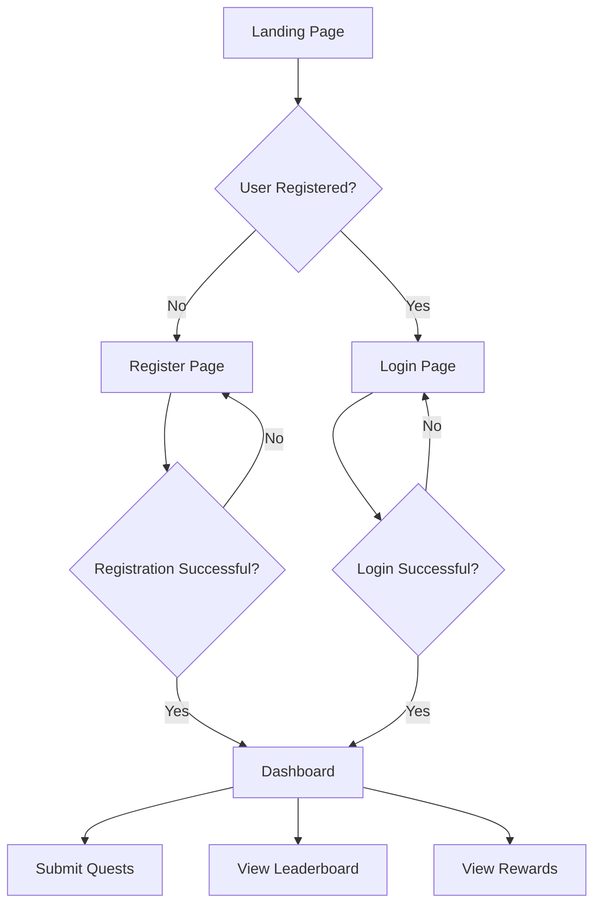

```mermaid
graph TD
    A[Landing Page] --> B{User Registered?};
    B -- No --> C[Register Page];
    B -- Yes --> D[Login Page];
    C --> E{Registration Successful?};
    E -- Yes --> F[Dashboard];
    E -- No --> C;
    D --> G{Login Successful?};
    G -- Yes --> F;
    G -- No --> D;
    F --> H[Submit Quests];
    F --> I[View Leaderboard];
    F --> J[View Rewards];
```
